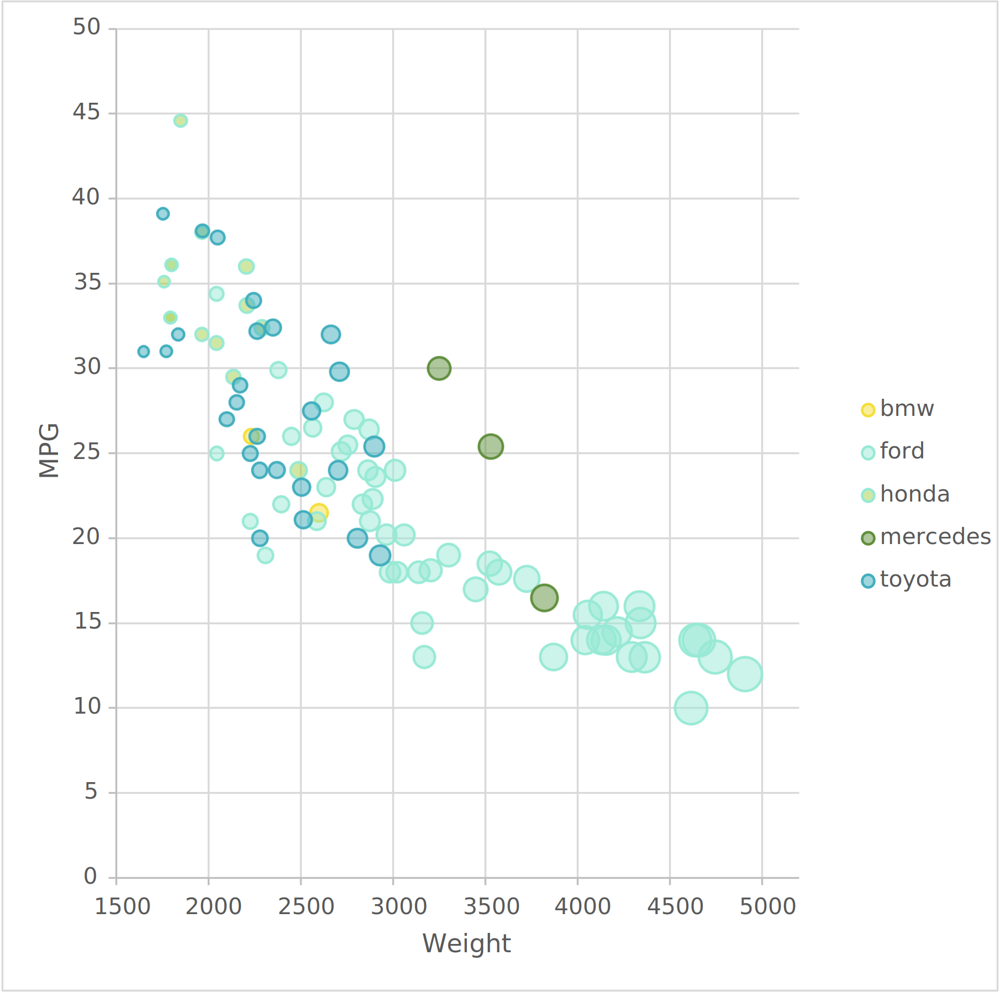
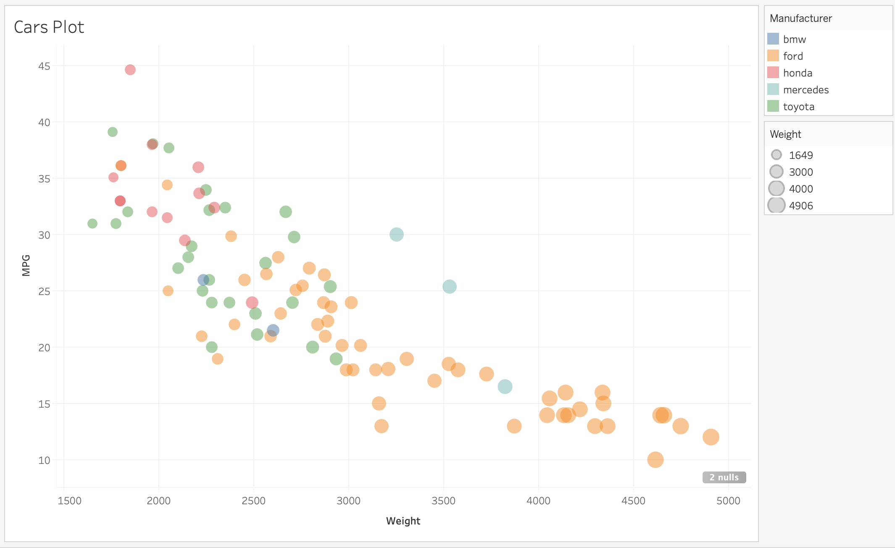
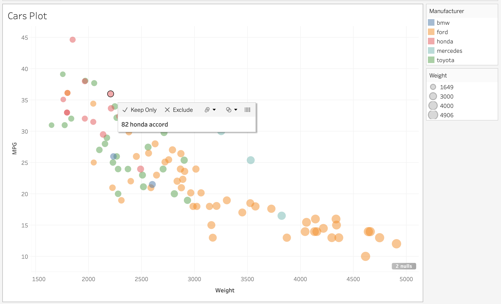

# 02-DataVis-5ways

# Visualization Way #1: ggplot2

I created the plot using ggplot. I also added interactivity using ggiraph. The only resources that I used to create this were the ggplot and ggiraph documentation.

Above is the basic image of the plot. It plots all of the points, and adjusts the size of the point based on the weight of the car and the color based on the model. The points are all an opacity of 0.5.

Above is an example of the interactivity that I got using ggiraph. When you hover over a point on the graph, you can view that car's year, make, and model.
I did this by researching interactivity in R and following up the ggiraph documentation

The plot itself is linked here: http://nshedd.github.io/02-DataVis-05Ways/ggplot_plot.html

R is pretty intuitive and I have a lot of experience with it, so I didn't use any additional resources. I use ggplot a lot for bioinformatic analysis, and I think that it is easy to use, so I predict I will use it a lot in the future.

# Visualization Way #2: matplotlib

I recreated the plot using matplotlib. I used an assortment of resources for references, including old homework assignments, matplotlib documentation, Kite documentation, and 1 or 2 stack overflow posts. 

I added code to remove any columns with NA values.

Above is the final plot. I manually assigned colors and point sizes. Each point was sized as w^3.5/1000^3.5, where w is the weight of the car. I thought that this equation gave a size gradient that was easier to see than just directly using the weight. 

I also designed 2 legends to include in the plot

I used code from previous data visualization projects to generate the plot, particularly the legends. Matplotlib was really difficult to use for a legend. It doesn't allow you to just use categorical labels for color, so it requires a lot of maneuvering with creating and renaming the legend items. 

# Visualization Way #3: d3.js

I recreated the plot using d3.js. The code is in index.html

In the csv function, I added a data filter to remove any rows with NA in the MPG column. 

I created a plot with custom colors and legends for the size color of the points. I used cool colors to give a better sense of uniformity, while still making it easy to tell the difference between different series.

I also included a background grid by setting teh axis tick length to the width of the plot. 

I also added interactivity where the color of the point changes to yellow on hover, based on tooltip documentation.

There were a few resources that I used to generate the plots. I used some of CodeCamp's videos and their code samples in VizHub: 
  1. https://www.youtube.com/watch?v=_8V5o2UHG0E&t=0s
  2. https://vizhub.com/undefined/9247d4d42df74185980f7b1f7504dcc5?edit=files&file=index.js
  
D3 was definitely very different than any of the other tools. It required a lot more manual coding of elements. Hoever, I was able to create 2 legends manually. I created a list of the colors/manufacturers and a list of the sizes. Similar to the way that you could create circles for every element in a dataset, I created matrices to create the circles and labels in the legend. This was a little bit difficualt, but much easier after realizing that I needed to create new 'g's for each legend.

# Visualization Way #4: Excel

I recreated the graph as a bubble plot in Microsoft Excel

I imported the csv file into excel. I created 5 series, one for each manufacturer, and used the Weight as the x axis and bubble size, and the MPG as the y axis. The 5 sizes were assigned different colors. I also had to manually create the tick marks at the right interval. I also adjusted the plot so the width of the bubbles represented the weight instead of the area of the bubbles. This made it much easier to see the difference between the different sizes.

I also manually adjusted the theme colors and the axis bounds for a more visually appealing plot. 

# Visualization Way #5: Tableau

I imported the csv file and created a plot and adjusted the weight and colors of the points. I then adjusted the axes to make tick lines below the axis and adjusted the bounds to fit the data

I also added a tooltip to display the year, make, and model of the car on hover.

Tableau was intuitive, so I didn't need to use any additional resources to do it.

Design Achievements
==
1) A well-thought out size gradient in matplotlib
2) Altered theme colors in excel and D3
3) Background grid in D3

Technical Achievements
==
1) Interactivity with ggplot2, D3, and tableau
2) Legends in matplotlib, python, D3, and tableau
3) Removed NAs with script in matplotlib and D3
